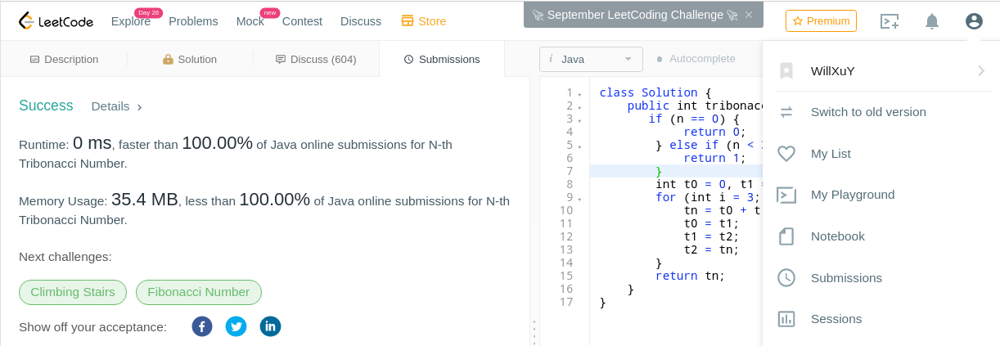

# I - ⚖️ License

Copyright (C) 2021  Weiyang(Will) Xu

This program is free software: you can redistribute it and/or modify
it under the terms of the GNU General Public License as published by
the Free Software Foundation, either version 3 of the License, or
(at your option) any later version.

This program is distributed in the hope that it will be useful,
but WITHOUT ANY WARRANTY; without even the implied warranty of
MERCHANTABILITY or FITNESS FOR A PARTICULAR PURPOSE.  See the
GNU General Public License for more details.

You should have received a copy of the GNU General Public License
along with this program.  If not, see <https://www.gnu.org/licenses/>.

# II - 📖 Profile
It's the project for solving problems from [leetCode](https://leetcode.com/problemset/all/)

# III - 🏗️ Project build
change the build tool to gradle, output a jar;

## i - hello spring boot

### 1 - build the project
- build the gradle

## ii - change junit4 to junit5

# IV - ⌛ Todo List

|No |title|solution|
|---|---|---|
|312|[Burst Balloons](https://leetcode.com/problems/burst-balloons/)|[bruteForce](src/test/java/org/willxu/algorithm/service/integer/BurstBalloonsTest.java)|

## TODO: try to add git emoji

# V - 📝 Finished List (main methods are in the test folder)

|No |title|solution|
|---|---|---|
|1|[Two Sum](https://leetcode.com/problems/two-sum/)|[bruteForce](src/test/java/org/willxu/algorithm/service/integerarray/TwoSumTest.java)|
|7|[Reverse Integer](https://leetcode.com/problems/reverse-integer/)|[bruteForce](src/test/java/org/willxu/algorithm/service/integer/ReverseIntegerTest.java)|
|9|[Palindrome Number](https://leetcode.com/problems/palindrome-number/)|[bruteForce](src/test/java/org/willxu/algorithm/service/bool/PalindromeNumberTest.java)|
|13|[Roman to Integer](https://leetcode.com/problems/roman-to-integer/)|[bruteForce](src/test/java/org/willxu/algorithm/service/integer/RomanToIntegerTest.java)|
|14|[Longest Common Prefix](https://leetcode.com/problems/longest-common-prefix/)|[bruteForce](src/test/java/org/willxu/algorithm/service/string/LongestCommonPrefixTest.java)|
|extra|Longest Common Sub String|[SubString](src/main/java/org/willxu/algorithm/service/impl/string/LongestCommonSubStringBruteForce.java)|
|20|[Valid Parentheses](https://leetcode.com/problems/valid-parentheses/)|[bruteForce](src/test/java/org/willxu/algorithm/service/bool/ValidParenthesesTest.java)|
|21|[Merge Two Sorted Lists](https://leetcode.com/problems/merge-two-sorted-lists/)|[bruteForce](src/test/java/org/willxu/algorithm/service/other/MergeTwoSortedListsTest.java)|
|26|[Remove Duplicates from Sorted Array](https://leetcode.com/problems/remove-duplicates-from-sorted-array/)|[bruteForce](src/test/java/org/willxu/algorithm/service/integer/RemoveDuplicatesFromSortedArrayTest.java)|
|27|[Remove Element](https://leetcode.com/problems/remove-element/)|[bruteForce](src/test/java/org/willxu/algorithm/service/integer/RemoveElementTest.java)|
|28|[Implement strStr()](https://leetcode.com/problems/implement-strstr/)|[bruteForce](src/test/java/org/willxu/algorithm/service/integer/ImplementStrStrTest.java)|
|35|[Search Insert Position](https://leetcode.com/problems/search-insert-position/)|[bruteForce](src/test/java/org/willxu/algorithm/service/integer/SearchInsertPositionTest.java)|
|53|[Maximum Subarray](https://leetcode.com/problems/maximum-subarray/)|[bruteForce](src/test/java/org/willxu/algorithm/service/integer/MaximumSubarrayTest.java)|
|58|[Length of Last Word](https://leetcode.com/problems/length-of-last-word/)|[bruteForce](src/test/java/org/willxu/algorithm/service/integer/LengthOfLastWordTest.java)|
|66|[Plus One](https://leetcode.com/problems/plus-one/)|[bruteForce](src/test/java/org/willxu/algorithm/service/integerarray/PlusOneTest.java)|
|67|[Add Binary](https://leetcode.com/problems/add-binary/)|[bruteForce](src/test/java/org/willxu/algorithm/service/string/AddBinaryTest.java)|
|69|[Sqrt(x)](https://leetcode.com/problems/sqrtx/)|[bruteForce](src/test/java/org/willxu/algorithm/service/integer/SqrtTest.java)|
|70|[Climbing Stairs](https://leetcode.com/problems/climbing-stairs/)|[bruteForce](src/test/java/org/willxu/algorithm/service/integer/ClimbingStairsTest.java)|
|mark|ideas|[ClimbingStair](static/idea/ClimbingStair.md)|
|83|[Remove Duplicates from Sorted List](https://leetcode.com/problems/remove-duplicates-from-sorted-list/)|[bruteForce](src/test/java/org/willxu/algorithm/service/other/RemoveDuplicatesFromSortedListTest.java)|
|88|[Merge Sorted Array](https://leetcode.com/problems/merge-sorted-array/)|[inverted](src/test/java/org/willxu/algorithm/service/empty/MergeSortedArrayTest.java)|
|94|[Binary Tree Inorder Traversal](https://leetcode.com/problems/binary-tree-inorder-traversal/)|[recursive](src/test/java/org/willxu/algorithm/service/integerlist/BinaryTreeInorderTraversalTest.java)|
|100|[Same Tree](https://leetcode.com/problems/same-tree/)|[Recursive](src/test/java/org/willxu/algorithm/service/bool/SameTreeTest.java)|
|101|[Symmetric Tree](https://leetcode.com/problems/symmetric-tree/)|[Recursive](src/test/java/org/willxu/algorithm/service/bool/SymmetricTreeTest.java)|
|104|[Maximum Depth of Binary Tree](https://leetcode.com/problems/maximum-depth-of-binary-tree/)|[level](src/test/java/org/willxu/algorithm/service/integer/MaximumDepthOfBinaryTreeTest.java)|
|108|[Convert Sorted Array to Binary Search Tree](https://leetcode.com/problems/convert-sorted-array-to-binary-search-tree/)|[half recursive](src/test/java/org/willxu/algorithm/service/treenode/ConvertSortedArrayToBinarySearchTreeTest.java)|
|110|[Balanced Binary Tree](https://leetcode.com/problems/balanced-binary-tree/)|[recursive](src/test/java/org/willxu/algorithm/service/bool/BalancedBinaryTreeTest.java)|
|111|[Minimum Depth of Binary Tree](https://leetcode.com/problems/minimum-depth-of-binary-tree/)|[level](src/test/java/org/willxu/algorithm/service/integer/MinimumDepthOfBinaryTreeTest.java)|
|112|[Path Sum](https://leetcode.com/problems/path-sum/)|[recursive](src/test/java/org/willxu/algorithm/service/bool/PathSumTest.java)|
|118|[Pascal's Triangle](https://leetcode.com/problems/pascals-triangle/)|[recursive](src/test/java/org/willxu/algorithm/service/matrix/PascalsTriangleTest.java)|
|119|[Pascal's Triangle II](https://leetcode.com/problems/pascals-triangle-ii/)|[recursive](src/test/java/org/willxu/algorithm/service/integerlist/PascalsTriangleIiTest.java)|
|121|[Best Time to Buy and Sell Stock](https://leetcode.com/problems/best-time-to-buy-and-sell-stock/submissions/)|[saveMin](src/test/java/org/willxu/algorithm/service/integer/BestTimeToBuyAndSellStockTest.java)|
|122|[Best Time to Buy and Sell Stock II](https://leetcode.com/problems/best-time-to-buy-and-sell-stock-ii/)|[greedy](src/test/java/org/willxu/algorithm/service/integer/BestTimeToBuyAndSellStockIiTest.java)|
|out|time out|[cycle](src/main/java/org/willxu/algorithm/service/impl/integer/BestTimeToBuyAndSellStockCycle.java)|
|125|[Valid Palindrome](https://leetcode.com/problems/valid-palindrome/)|[preprocessing](src/test/java/org/willxu/algorithm/service/bool/ValidPalindromeTest.java)|
|136|[Single Number](https://leetcode.com/problems/single-number/)|[set](src/test/java/org/willxu/algorithm/service/integer/SingleNumberTest.java)|
|141|[Linked List Cycle](https://leetcode.com/problems/linked-list-cycle/)|[iterator](src/test/java/org/willxu/algorithm/service/bool/LinkedListCycleTest.java)|
|144|[Binary Tree Preorder Traversal](https://leetcode.com/problems/binary-tree-preorder-traversal/)|[recursive](src/test/java/org/willxu/algorithm/service/integerlist/BinaryTreePreorderTraversalTest.java)|
|145|[Binary Tree Postorder Traversal](https://leetcode.com/problems/binary-tree-postorder-traversal/)|[recursive](src/test/java/org/willxu/algorithm/service/integerlist/BinaryTreePostOrderTraversalTest.java)|
|155|[Min Stack](https://leetcode.com/problems/min-stack/)|[brute force](src/test/java/org/willxu/algorithm/domain/stack/MinStackTest.java)|
|160|[Intersection of Two Linked Lists](https://leetcode.com/problems/intersection-of-two-linked-lists/)|[save nodes](src/test/java/org/willxu/algorithm/service/listnode/IntersectionOfTwoLinkedListsTest.java)|
|167|[Two Sum II - Input array is sorted](https://leetcode.com/problems/two-sum-ii-input-array-is-sorted/)|[traversal](src/test/java/org/willxu/algorithm/service/integerlist/TwoSumIiInputArrayIsSortedTest.java)|
|168|[Excel Sheet Column Title](https://leetcode.com/problems/excel-sheet-column-title/)|[recursive](src/test/java/org/willxu/algorithm/service/string/ExcelSheetColumnTitleTest.java)|
|169|[Majority Element](https://leetcode.com/problems/majority-element/)|[map](src/test/java/org/willxu/algorithm/service/integer/MajorityElementTest.java)|
|171|[Excel Sheet Column Number](https://leetcode.com/problems/excel-sheet-column-number/)|[Add](src/test/java/org/willxu/algorithm/service/integer/ExcelSheetColumnNumberTest.java)|
|172|[Factorial Trailing Zeroes](https://leetcode.com/problems/factorial-trailing-zeroes/)|[Find5](src/test/java/org/willxu/algorithm/service/integer/FactorialTrailingZeroesTest.java)|
|175|[Combine Two Tables](https://leetcode.com/problems/combine-two-tables/)|[mysql](src/main/resources/CombineTwoTables.sql)|
|176|[Second Highest Salary](https://leetcode.com/problems/second-highest-salary/)|[mysql](src/main/resources/CombineTwoTables.sql)|
|181|[Employees Earning More Than Their Managers](https://leetcode.com/problems/employees-earning-more-than-their-managers/)|[mysql](src/main/resources/CombineTwoTables.sql)|
|182|[Duplicate Emails](https://leetcode.com/problems/duplicate-emails/)|[mysql](src/main/resources/CombineTwoTables.sql)|
|183|[Customers Who Never Order](https://leetcode.com/problems/customers-who-never-order/)|[mysql](src/main/resources/CombineTwoTables.sql)|
|190|[Reverse Bits](https://leetcode.com/problems/reverse-bits/)|[ToString](src/test/java/org/willxu/algorithm/service/integer/ReverseBitsTest.java)|
|191|[Number of 1 Bits](https://leetcode.com/problems/number-of-1-bits/)|[Move right](src/test/java/org/willxu/algorithm/service/integer/NumberOf1BitsTest.java)|
|193|[Valid Phone Numbers](https://leetcode.com/problems/valid-phone-numbers/)|[Bash](src/main/bash/ValidPhoneNumber.bash)|
|195|[Tenth Line](https://leetcode.com/problems/tenth-line/)|[Bash](src/main/bash/ValidPhoneNumber.bash)|
|196|[Delete Duplicate Emails](https://leetcode.com/problems/delete-duplicate-emails/)|[mysql](src/main/resources/CombineTwoTables.sql)|
|197|[Rising Temperature](https://leetcode.com/problems/rising-temperature/)|[mysql](src/main/resources/CombineTwoTables.sql)|
|202|[Happy Number](https://leetcode.com/problems/happy-number/)|[Loop](src/test/java/org/willxu/algorithm/service/bool/HappyNumberTest.java)|
|203|[Remove Linked List Elements](https://leetcode.com/problems/remove-linked-list-elements/)|[Pointer](src/test/java/org/willxu/algorithm/service/listnode/RemoveLinkedListElementsTest.java)|
|204|[Count Primes](https://leetcode.com/problems/count-primes/)|[Mark remove](src/test/java/org/willxu/algorithm/service/integer/CountPrimesTest.java)|
|205|[Isomorphic Strings](https://leetcode.com/problems/isomorphic-strings/)|[Remove](src/test/java/org/willxu/algorithm/service/bool/IsomorphicStringsTest.java)|
|206|[Reverse Linked List](https://leetcode.com/problems/reverse-linked-list/)|[Iterator](src/test/java/org/willxu/algorithm/service/listnode/ReverseLinkedListTest.java)|
|209|[Minimum Size Subarray Sum](https://leetcode.com/problems/minimum-size-subarray-sum/)|[bruteForce](src/test/java/org/willxu/algorithm/service/integer/MinimumSizeSubarraySumTest.java)|
|other|better|[better](src/main/java/org/willxu/algorithm/service/impl/integer/MinimumSizeSubarraySumBetter.java)|
|217|[Contains Duplicate](https://leetcode.com/problems/contains-duplicate/)|[Set](src/test/java/org/willxu/algorithm/service/bool/ContainsDuplicateTest.java)|
|219|[Contains Duplicate II](https://leetcode.com/problems/contains-duplicate-ii/)|[Map key](src/test/java/org/willxu/algorithm/service/bool/ContainsDuplicateIiTest.java)|
|225|[Implement Stack using Queues](https://leetcode.com/problems/implement-stack-using-queues/)|[Queues](src/test/java/org/willxu/algorithm/domain/stack/MyQueuesStackTest.java)|
|226|[Invert Binary Tree](https://leetcode.com/problems/invert-binary-tree/)|[Recursive](src/test/java/org/willxu/algorithm/service/treenode/InvertBinaryTreeTest.java)|
|228|[Summary Ranges](https://leetcode.com/problems/summary-ranges/)|[Cycle](src/test/java/org/willxu/algorithm/service/stringlist/SummaryRangesTest.java)|
|231|[Power of Two](https://leetcode.com/problems/power-of-two/)|[Binary](src/test/java/org/willxu/algorithm/service/bool/PowerOfTwoTest.java)|
|232|[Implement Queue using Stacks](https://leetcode.com/problems/implement-queue-using-stacks/)|[Stacks](src/test/java/org/willxu/algorithm/domain/queue/StacksQueueTest.java)|
|234|[Palindrome Linked List](https://leetcode.com/problems/palindrome-linked-list/)|[Array](src/test/java/org/willxu/algorithm/service/bool/PalindromeLinkedListTest.java)|
| |other|[Stack and Queue](src/main/java/org/willxu/algorithm/service/impl/bool/PalindromeLinkedListStackAndQueue.java)|
|235|[Lowest Common Ancestor of a Binary Search Tree](https://leetcode.com/problems/lowest-common-ancestor-of-a-binary-search-tree/)|[Recursive](src/test/java/org/willxu/algorithm/service/treenode/LowestCommonAncestorOfBstTest.java)|
|237|[Delete Node in a Linked List](https://leetcode.com/problems/delete-node-in-a-linked-list/)|[Point](src/test/java/org/willxu/algorithm/service/empty/DeleteNodeInLinkedListTest.java)|
|242|[Valid Anagram](https://leetcode.com/problems/valid-anagram/)|[Remove](src/test/java/org/willxu/algorithm/service/bool/ValidAnagramTest.java)|
|257|[Binary Tree Paths](https://leetcode.com/problems/binary-tree-paths/)|[Recursive](src/test/java/org/willxu/algorithm/service/stringlist/BinaryTreePathsTest.java)|
|258|[Add Digits](https://leetcode.com/problems/add-digits/)|[Loop](src/test/java/org/willxu/algorithm/service/integer/AddDigitsTest.java)|
|263|[Ugly Number](https://leetcode.com/problems/ugly-number/)|[Divide](src/test/java/org/willxu/algorithm/service/bool/UglyNumberTest.java)|
|268|[Missing Number](https://leetcode.com/problems/missing-number/)|[Remove](src/test/java/org/willxu/algorithm/service/integer/MissingNumberTest.java)|
|278|[First Bad Version](https://leetcode.com/problems/first-bad-version/)|[Golden](src/test/java/org/willxu/algorithm/service/extend/FirstBadVersionTest.java)|
|282|[Expression Add Operators](https://leetcode.com/problems/expression-add-operators/)|[bruteForce](src/test/java/org/willxu/algorithm/service/stringlist/ExpressionAndOperatorServiceTest.java)|
|283|[Move Zeroes](https://leetcode.com/problems/move-zeroes/)|[Exchange](src/test/java/org/willxu/algorithm/service/empty/MoveZerosTest.java)|
|290|[Word Pattern](https://leetcode.com/problems/word-pattern/)|[Map](src/test/java/org/willxu/algorithm/service/bool/WordPatternTest.java)|
|292|[Nim Game](https://leetcode.com/problems/nim-game/)|[Divide4](src/test/java/org/willxu/algorithm/service/bool/NimGameTest.java)|
|303|[Range Sum Query - Immutable](https://leetcode.com/problems/range-sum-query-immutable/)|[Cycle](src/test/java/org/willxu/algorithm/domain/array/RangeSumQueryImmutableTest.java)|
|326|[Power of Three](https://leetcode.com/problems/power-of-three/)|[Enumeration](src/test/java/org/willxu/algorithm/service/bool/PowerOfThreeTest.java)|
|338|[Counting Bits](https://leetcode.com/problems/counting-bits/)|[Cycle multi 2](src/test/java/org/willxu/algorithm/service/integerarray/CountingBitsTest.java)|
|342|[Power of Four](https://leetcode.com/problems/power-of-four/)|[Enumerate](src/test/java/org/willxu/algorithm/service/bool/PowerOfFourTest.java)|
|344|[Reverse String](https://leetcode.com/problems/reverse-string/)|[Exchange](src/test/java/org/willxu/algorithm/service/empty/ReverseStringTest.java)|
|345|[Reverse Vowels of a String](https://leetcode.com/problems/reverse-vowels-of-a-string/)|[Pointer](src/test/java/org/willxu/algorithm/service/string/ReverseVowelsOfaStringTest.java)|
|349|[Intersection of Two Arrays](https://leetcode.com/problems/intersection-of-two-arrays/)|[Set](src/test/java/org/willxu/algorithm/service/intarray/IntersectionOfTwoArraysTest.java)|
|350|[Intersection of Two Arrays II](https://leetcode.com/problems/intersection-of-two-arrays-ii/)|[Remove](src/test/java/org/willxu/algorithm/service/intarray/IntersectionOfTwoArraysIiTest.java)|
|367|[Valid Perfect Square](https://leetcode.com/problems/valid-perfect-square/)|[Difference](src/test/java/org/willxu/algorithm/service/bool/ValidPerfectSquareTest.java)|
|374|[Guess Number Higher or Lower](https://leetcode.com/problems/guess-number-higher-or-lower/)|[Golden](src/test/java/org/willxu/algorithm/domain/integer/GuessNumberHigherOrLowerTest.java)|
|383|[Ransom Note](https://leetcode.com/problems/ransom-note/)|[Remove](src/test/java/org/willxu/algorithm/service/bool/RansomNoteTest.java)|
|387|[First Unique Character in a String](https://leetcode.com/problems/first-unique-character-in-a-string/)|[Remove](src/test/java/org/willxu/algorithm/service/integer/FirstUniqueCharacterInaStringTest.java)|
|389|[Find the Difference](https://leetcode.com/problems/find-the-difference/)|[Remove](src/test/java/org/willxu/algorithm/service/character/FindTheDifferenceTest.java)|
|392|[Is Subsequence](https://leetcode.com/problems/is-subsequence/)|[Iterator](src/test/java/org/willxu/algorithm/service/bool/IsSubsequenceTest.java)|
|401|[Binary Watch](https://leetcode.com/problems/binary-watch/)|[Combinations](src/test/java/org/willxu/algorithm/service/stringlist/BinaryWatchTest.java)|
|404|[Sum of Left Leaves](https://leetcode.com/problems/sum-of-left-leaves/)|[Recursive](src/test/java/org/willxu/algorithm/service/integer/SumOfLeftLeavesTest.java)|
|405|[Convert a Number to Hexadecimal](https://leetcode.com/problems/convert-a-number-to-hexadecimal/)|[Remainder](src/test/java/org/willxu/algorithm/service/string/ConvertaNumberToHexadecimalTest.java)|
|409|[Longest Palindrome](https://leetcode.com/problems/longest-palindrome/)|[Count](src/test/java/org/willxu/algorithm/service/integer/LongestPalindromeTest.java)|
|412|[Fizz Buzz](https://leetcode.com/problems/fizz-buzz/)|[Cycle](src/test/java/org/willxu/algorithm/service/stringlist/FizzBuzzTest.java)|
|414|[Third Maximum Number](https://leetcode.com/problems/third-maximum-number/)|[Compare](src/test/java/org/willxu/algorithm/service/integer/ThirdMaximumNumberTest.java)|
|415|[Add Strings](https://leetcode.com/problems/add-strings/)|[Split](src/test/java/org/willxu/algorithm/service/string/AddStringsTest.java)|
|432|[All O'one Date Structure](https://leetcode.com/problems/all-oone-data-structure/)|[Array](src/test/java/org/willxu/algorithm/domain/other/AllOneTest.java)|
|434|[Number of Segments in a String](https://leetcode.com/problems/number-of-segments-in-a-string/)|[Space](src/test/java/org/willxu/algorithm/service/integer/NumberOfSegmentsInaStringTest.java)|
|441|[Arranging Coins](https://leetcode.com/problems/arranging-coins/)|[Equation](src/test/java/org/willxu/algorithm/service/integer/ArrangingCoinsTest.java)|
| | Cycle | [src](src/main/java/org/willxu/algorithm/service/impl/integer/ArrangingCoinsCycle.java) |
|448|[Find All Numbers Disappeared in an Array](https://leetcode.com/problems/find-all-numbers-disappeared-in-an-array/)|[Cycle](src/test/java/org/willxu/algorithm/service/intlist/FindAllNumbersDisappearedInAnArrayTest.java)|
|453|[Minimum Moves to Equal Array Elements](https://leetcode.com/problems/minimum-moves-to-equal-array-elements-description/)|[Math](src/test/java/org/willxu/algorithm/service/integer/MinimumMovesToEqualArrayElementsTest.java)|
|455|[Assign Cookies](https://leetcode.com/problems/assign-cookies/)|[Map](src/test/java/org/willxu/algorithm/service/integer/AssignCookiesTest.java)|
|459|[Repeated Substring Pattern](https://leetcode.com/problems/repeated-substring-pattern/)|[Pointer](src/test/java/org/willxu/algorithm/service/bool/RepeatedSubstringPatternTest.java)|
|461|[Hamming Distance](https://leetcode.com/problems/hamming-distance/)|[Dividing](src/test/java/org/willxu/algorithm/service/integer/HammingDistanceTest.java)|
|463|[Island Perimeter](https://leetcode.com/problems/island-perimeter/)|[Remove Public Edge](src/test/java/org/willxu/algorithm/service/integer/IslandPerimeterTest.java)|
|476|[Number Complement](https://leetcode.com/problems/number-complement/)|[Dividing](src/test/java/org/willxu/algorithm/service/integer/NumberComplementTest.java)|
|482|[License Key Formatting](https://leetcode.com/problems/license-key-formatting/)|[Loop](src/test/java/org/willxu/algorithm/service/string/LicenseKeyFormattingTest.java)|
|485|[Max Consecutive Ones](https://leetcode.com/problems/max-consecutive-ones/)|[Loop](src/test/java/org/willxu/algorithm/service/integer/MaxConsecutiveOnesTest.java)|
|492|[Construct the Rectangle](https://leetcode.com/problems/construct-the-rectangle/)|[Sqrt](src/test/java/org/willxu/algorithm/service/ints/ConstructTheRectangleTest.java)|
|495|[Teemo Attacking](https://leetcode.com/problems/teemo-attacking/)|[Loop](src/test/java/org/willxu/algorithm/service/integer/TeemoAttackingTest.java)|
|496|[Next Greater Element I](https://leetcode.com/problems/next-greater-element-i/)|[Set Index](src/test/java/org/willxu/algorithm/service/ints/NextGreaterElement1Test.java)|
|500|[Keyboard Row](https://leetcode.com/problems/keyboard-row/)|[Count](src/test/java/org/willxu/algorithm/service/stringlist/KeyboardRowTest.java)|
|501|[Find Mode in Binary Search Tree](https://leetcode.com/problems/find-mode-in-binary-search-tree/)|[Recursive](src/test/java/org/willxu/algorithm/service/ints/FindModeInBinarySearchTreeTest.java)|
|504|[Base 7](https://leetcode.com/problems/base-7/)|[Division](src/test/java/org/willxu/algorithm/service/string/Base7Test.java)|
|506|[Relative Ranks](https://leetcode.com/problems/relative-ranks/)|[Pointer](src/test/java/org/willxu/algorithm/service/strings/RelativeRanksTest.java)|
|507|[Perfect Number](https://leetcode.com/problems/perfect-number/)|[Division](src/test/java/org/willxu/algorithm/service/bool/PerfectNumberTest.java)|
|509|[Fibonacci Number](https://leetcode.com/problems/fibonacci-number/)|[Loop](src/test/java/org/willxu/algorithm/service/integer/FibonacciNumberTest.java)|
|520|[Detect Capital](https://leetcode.com/problems/detect-capital/)|[Loop](src/test/java/org/willxu/algorithm/service/bool/DetectCapitalTest.java)|
|521|[Longest Uncommon Subsequence I](https://leetcode.com/problems/longest-uncommon-subsequence-i/)|[Endpoint](src/test/java/org/willxu/algorithm/service/integer/LongestUncommonSubsequence1Test.java)|
|530|[Minimum Absolute Difference in BST](https://leetcode.com/problems/minimum-absolute-difference-in-bst/)|[Recursive](src/test/java/org/willxu/algorithm/service/integer/MinimumAbsoluteDifferenceInBstTest.java)|
|541|[Reverse String II](https://leetcode.com/problems/reverse-string-ii/)|[Loop](src/test/java/org/willxu/algorithm/service/string/ReverseStringIiTest.java)|
|543|[Diameter of Binary Tree](https://leetcode.com/problems/diameter-of-binary-tree/)|[Recursive](src/test/java/org/willxu/algorithm/service/integer/DiameterOfBinaryTreeTest.java)|
|551|[Student Attendance Record I](https://leetcode.com/problems/student-attendance-record-i/)|[Loop](src/test/java/org/willxu/algorithm/service/bool/StudentAttendanceRecord1Test.java)|
|557|[Reverse Words in a String III](https://leetcode.com/problems/reverse-words-in-a-string-iii/)|[Index](src/test/java/org/willxu/algorithm/service/string/ReverseWordsInaString3Test.java)|
|559|[Maximum Depth of N-ary Tree](https://leetcode.com/problems/maximum-depth-of-n-ary-tree/)|[Recursive](src/test/java/org/willxu/algorithm/service/integer/MaximumDepthOfNaryTreeTest.java)|
|561|[Array Partition I](https://leetcode.com/problems/array-partition-i/)|[Order](src/test/java/org/willxu/algorithm/service/integer/ArrayPartition1Test.java)|
|563|[Binary Tree Tilt](https://leetcode.com/problems/binary-tree-tilt/)|[Recursive](src/test/java/org/willxu/algorithm/service/integer/BinaryTreeTiltTest.java)|
|566|[Reshape the Matrix](https://leetcode.com/problems/reshape-the-matrix/)|[Iterator](src/test/java/org/willxu/algorithm/service/matrix/ReshapeTheMatrixTest.java)|
|572|[Subtree of Another Tree](https://leetcode.com/problems/subtree-of-another-tree/)|[Recursive](src/test/java/org/willxu/algorithm/service/bool/SubtreeOfAnotherTreeTest.java)|
|575|[Distribute Candies](https://leetcode.com/problems/distribute-candies/)|[Group](src/test/java/org/willxu/algorithm/service/integer/DistributeCandiesTest.java)|
|589|[N-ary Tree Preorder Traversal](https://leetcode.com/problems/n-ary-tree-preorder-traversal/)|[Recursive](src/test/java/org/willxu/algorithm/service/intlist/NaryTreePreorderTraversalTest.java)|
|590|[N-ary Tree Postorder Traversal](https://leetcode.com/problems/n-ary-tree-postorder-traversal/)|[Recursive](src/test/java/org/willxu/algorithm/service/intlist/NaryTreePostorderTraversalTest.java)|
|594|[Longest Harmonious Subsequence](https://leetcode.com/problems/longest-harmonious-subsequence/)|[Count](src/test/java/org/willxu/algorithm/service/integer/LongestHarmoniousSubsequenceTest.java)|
|595|[Big Countries](https://leetcode.com/problems/big-countries/)|[where](src/main/resources/BigContries.sql)|
|596|[Classes More Than 5 Students](https://leetcode.com/problems/classes-more-than-5-students/)|[Count](src/main/resources/ClassesMoreThan5Students.sql)|
|598|[Range Addition II](https://leetcode.com/problems/range-addition-ii/)|[Conjunction](src/test/java/org/willxu/algorithm/service/integer/RangeAddition2Test.java)|
|599|[Minimum Index Sum of Two Lists](https://leetcode.com/problems/minimum-index-sum-of-two-lists/)|[Map](src/test/java/org/willxu/algorithm/service/strarray/MinimumIndexSumOfTwoListsTest.java)|
|605|[Can Place Flowers](https://leetcode.com/problems/can-place-flowers/)|[Iterator](src/test/java/org/willxu/algorithm/service/bool/CanPlaceFlowersTest.java)|
|606|[Construct String from Binary Tree](https://leetcode.com/problems/construct-string-from-binary-tree/)|[Recursive](src/test/java/org/willxu/algorithm/service/string/ConstructStringFromBinaryTreeTest.java)|
|617|[Merge Two Binary Trees](https://leetcode.com/problems/merge-two-binary-trees/)|[Recursive](src/test/java/org/willxu/algorithm/service/treenode/MergeTwoBinaryTreesTest.java)|
|620|[Not Boring Movies](https://leetcode.com/problems/not-boring-movies/submissions/)|[Sql](src/main/resources/NotBoringMovies.sql)|
|627|[Swap Salary](https://leetcode.com/problems/swap-salary/)|[Sql](src/main/resources/SwapSalary.sql)|
|628|[Maximum Product of Three Numbers](https://leetcode.com/problems/maximum-product-of-three-numbers/)|[Classify](src/test/java/org/willxu/algorithm/service/integer/MaximumProductOfThreeNumbersTest.java)|
|637|[Average of Levels in Binary Tree](https://leetcode.com/problems/average-of-levels-in-binary-tree/)|[Level](src/test/java/org/willxu/algorithm/service/doublelist/AverageOfLevelsInBinaryTreeTest.java)|
|643|[Maximum Average Subarray I](https://leetcode.com/problems/maximum-average-subarray-i/)|[Loop](src/test/java/org/willxu/algorithm/service/doublepoint/MaximumAverageSubarray1Test.java)|
|645|[Set Mismatch](https://leetcode.com/problems/set-mismatch/)|[Loop](src/test/java/org/willxu/algorithm/service/ints/SetMismatchTest.java)|
|653|[Two Sum IV - Input is a BST](https://leetcode.com/problems/two-sum-iv-input-is-a-bst/)|[Recursive](src/test/java/org/willxu/algorithm/service/bool/TwoSum4InputIsBstTest.java)|
|657|[Robot Return to Origin](https://leetcode.com/problems/robot-return-to-origin/)|[Count](src/test/java/org/willxu/algorithm/service/bool/RobotReturnToOriginTest.java)|
|661|[Image Smoother](https://leetcode.com/problems/image-smoother/)|[Iterator](src/test/java/org/willxu/algorithm/service/matrix/ImageSmootherTest.java)|
|671|[Second Minimum Node In a Binary Tree](https://leetcode.com/problems/second-minimum-node-in-a-binary-tree/)|[Level](src/test/java/org/willxu/algorithm/service/integer/SecondMinimumNodeInBinaryTreeTest.java)|
|674|[Longest Continuous Increasing Subsequence](https://leetcode.com/problems/longest-continuous-increasing-subsequence/)|[Loop](src/test/java/org/willxu/algorithm/service/integer/LongestContinuousIncreasingSubsequenceTest.java)|
|680|[Valid Palindrome II](https://leetcode.com/problems/valid-palindrome-ii/)|[Loop](src/test/java/org/willxu/algorithm/service/bool/ValidPalindrome2Test.java)|
|682|[Baseball Game](https://leetcode.com/problems/baseball-game/)|[List](src/test/java/org/willxu/algorithm/service/integer/BaseballGameTest.java)|
|693|[Binary Number with Alternating Bits](https://leetcode.com/problems/binary-number-with-alternating-bits/)|[Divide](src/test/java/org/willxu/algorithm/service/bool/BinaryNumberWithAlternatingBitsTest.java)|
|696|[Count Binary Substrings](https://leetcode.com/problems/count-binary-substrings/)|[Loop](src/test/java/org/willxu/algorithm/service/integer/CountBinarySubstringsTest.java)|

## [622. Design Circular Queue](https://leetcode.com/problems/design-circular-queue/)
### double-linked list: [CircularQueueDoubleLinked](src/test/java/org/willxu/algorithm/domain/queue/DesignCircularQueueTest.java)
总结： 参考 LinkedList 然后直接用 new Node 来操作结点数据容易出错，添加 changeNext 来方便修改引用
### single-linked list: [CircularQueueSingleLinked](src/test/java/org/willxu/algorithm/domain/queue/DesignCircularQueueTest.java)
- 优化可能： 使用单向链表，而不是参考 linked 的双向链表
- 结果：单向链表多持有了一个 last 结点来加快获取引用，占用了更多的内存，速度差距不大

## [1552.Magnetic Force Between Two Balls](https://leetcode.com/problems/magnetic-force-between-two-balls/)
- brute force: [bruteForce](src/test/java/org/willxu/algorithm/service/integer/MagneticForceBetweenTwoBallsTest.java)
- // TODO wrong answer but no official solution of leetcode.

## [984. String Without AAA or BBB](https://leetcode.com/problems/string-without-aaa-or-bbb/)
brute force: [bruteForce](src/test/java/org/willxu/algorithm/service/string/StringWithoutAaaOrBbbServiceTest.java)

## [1137.N-th Tribonacci Number](https://leetcode.com/problems/n-th-tribonacci-number/)
code: [NthTribonacciNumber](src/test/java/org/willxu/algorithm/service/integer/NthTribonacciNumberTest.java)

## [412.Fizz Buzz](https://leetcode.com/problems/fizz-buzz/)
- todo deal with the old code 
code: [fizzBuzz](src/test/java/org/willxu/algorithm/service/stringlist/FizzBuzzServiceTest.java)

